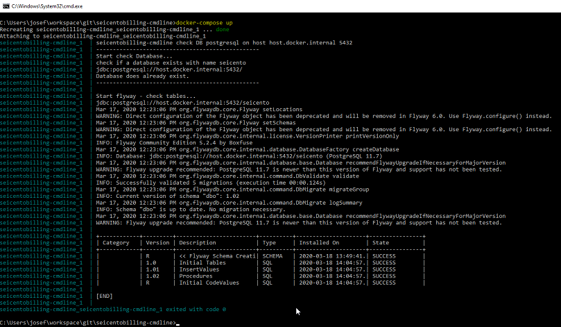

# SeicentoBilling - cmdline

## Aufgabe
Bei SecentoBilling - cmdline handelt es sich um ein Tool für das Aufsetzen einer Datenbank für [Seicento Billing](https://github.com/xware-gmbh/SeicentoBilling)

Folgende Datenbanken sind unterstützt und können konfiguriert werden.

* Microsoft SQL Server ab Version 12
* Postgressql ab Version 11

## Voraussetzungen
* Installierte Docker Version (ab Version 18), mit docker-compose
* Ein verfügbarer DB Server (remote oder lokal)

## DB Verbindung
* Beziehen (clone) der Sourcen von Github
* Öffnen cmd in root des Projektes
* Anpassen .env Datei mit den gewünschten DB Settings (Typ, Host, user, passwort...)
* Starten image mit docker-compose up

Das Image wird von Docker von dockerhub bezogen und die DB wird initialisiert.

### Sample Screen

 